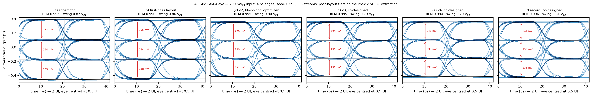
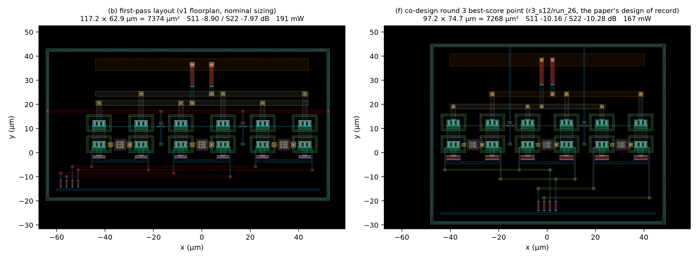
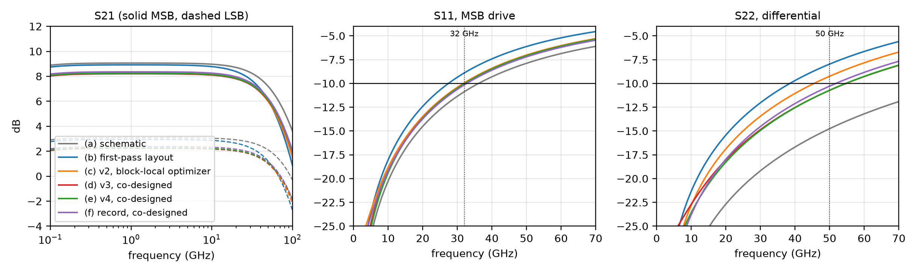
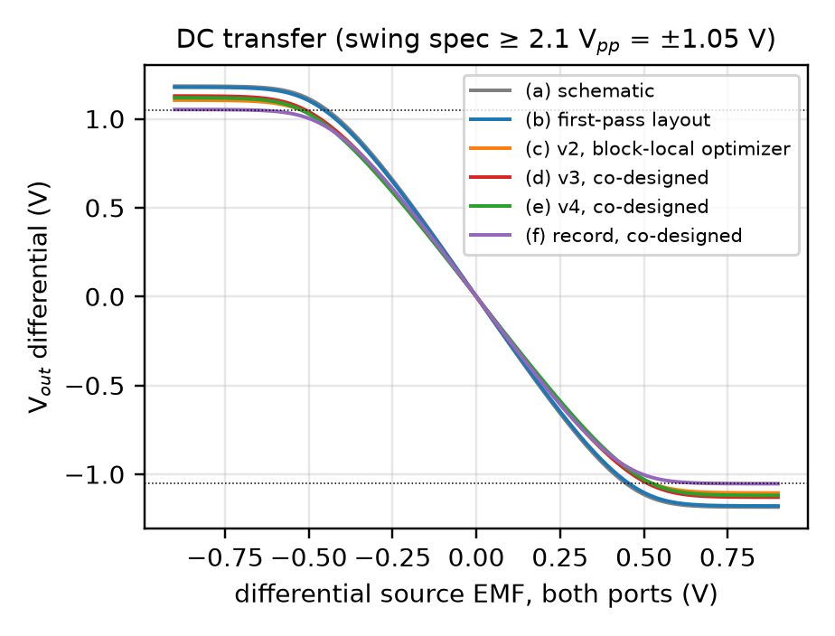
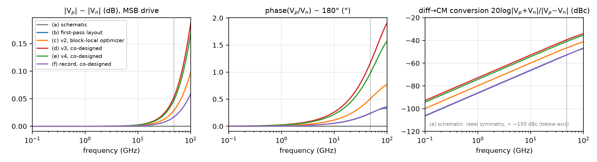
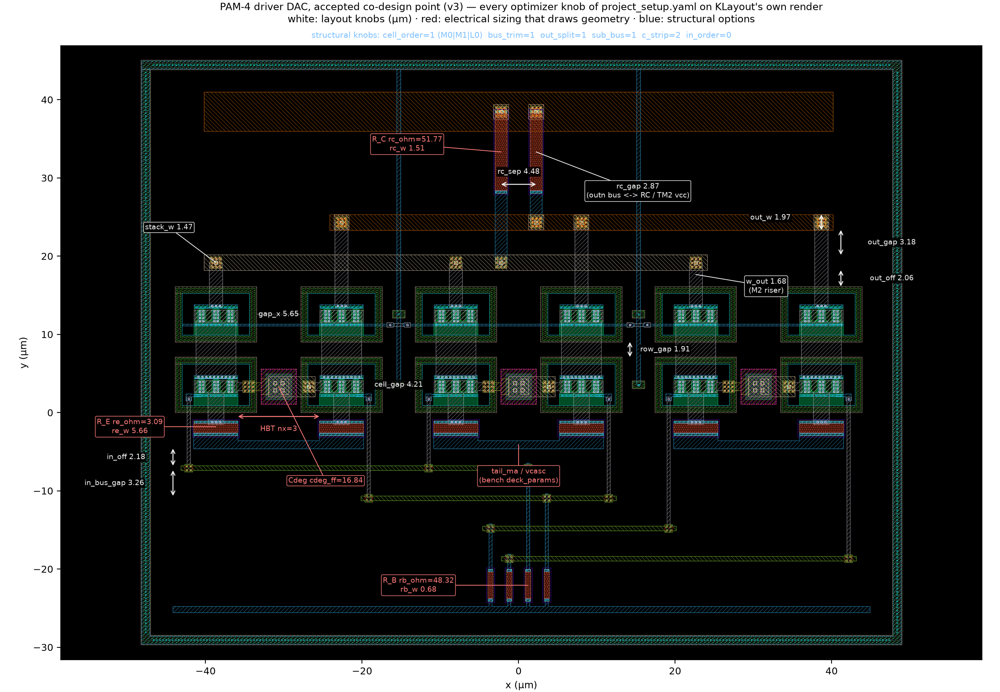

# Agentic design of a 96 Gb/s PAM-4 driver — IHP SG13G2 (130 nm SiGe BiCMOS)

AI-agent-driven, fully scripted design of an inductorless PAM-4 optical
modulator driver — a block-level replication of *Inac et al., "Inductorless
96 Gb/s PAM-4 Optical Modulators Driver in SiGe:C BiCMOS," EuMIC 2022* on
the open IHP SG13G2 PDK — taken from netlist to DRC/LVS-clean parameterized
layout, kpex extraction, and a layout + electrical co-optimization that
closes **all eight post-layout specs**.

- **Two optimization stages.** A block-local optimizer produced v2; the
  paper's **layout/schematic co-design algorithm** then ran **through the
  SpiceXplorer platform** (`spicexplorer-optimize`, `sim_engine: layout`).
- **The layout of record is `gen_layout.FINAL_LAYOUT`** — the co-design
  round-3 best-score point `r3_s12/run_26`, report tier (f).
- **Audit trail:** four notebooks plus a self-contained **reviewer report**
  ([`report/`](report/README.md)) — schematic versus every layout tier
  through the same benches, DRC/LVS/PEX evidence, GDS + netlists, KLayout
  renders, eyes, tables (`make report`).
- **Every number in the final table re-runs by hand** from static ngspice
  decks: [`verification/`](verification/README.md) (`make verify-report`).

## Layout history: v1 → v2 → v3 → v4 → the record

Original v1 layout (edge-fed input, 1.8 µm output-bus gap, nx=2 / R_C=70 Ω
electrical point) → the co-designed v4 layout:


### v1 → v2 — what the first pass missed, and what fixed it

The first optimization pass scored only S11/BW/gain/power. Its winner
(nx=2, R_C=70 Ω) met those four and **failed S22 (−8.3 dB) and output swing
(2.07 Vpp)**; neither was in the objective, so the full signoff in notebook
03 was the first bench to measure them. An expert RF layout review plus a
directed probe ladder produced the v2 fix (`layout/before_after_v2.png`
shows v1 → v2).

**Once the layout was repaired, the electrical optimum returned to the
paper's nominal topology** (nx=3, R_C=50 Ω): the nx=2 / R_C=70 Ω sizing had
been compensating layout parasitics.

| step | what was learned / changed | effect |
|---|---|---|
| v1 signoff | S22 and swing were never in the objective — R_C=70 bought gain with output mismatch | S22 −8.3 ✗, swing 2.07 ✗ |
| C-budget from extraction | output C, not R_C mismatch, limits S22: ~14 fF/side of bus wiring (kpex charges TM1 37 aF/µm of *edge* to substrate — length is everything) + ~14 fF/side cascode junctions; outp↔outn sidewall counts **double** differentially | fix must be geometric |
| output-network fixes | bus gap 1.8→8 µm, min-width TM1, slim risers/via stacks, ±1.5 µm overhang, compacted row | S22 −8.4 → **−10.14** at R_C=50 |
| input-network fixes | center-fed H-tree R_B (kills the far-MSB-cell ~80 µm stub), Metal4 buses with MSB rows innermost, 3 µm pair gap, Metal2 base drops | msb S11 at nx=3: −8.8 → −9.9 |
| electrical re-tune | tail 15 mA, R_B 48, V_casc 3.35, and **R_E 2.5→3.2 Ω** — series feedback shrinks the effective input C (the HBT model scales with Nx only) | S11 **−10.03** ✓ with gain 8.25 ✓ |
| verify | kpex RC mode ≡ CC mode to 0.01 dB; DRC + LVS clean on all 3 DUTs | point frozen as v2 (`gen_layout.V2_LAYOUT`) |

### v3 — co-design through the platform (2026-08-18)

Running the same loop *through* `spicexplorer-optimize` (Algorithm 1 of the
TCAS paper: agent owns the generator + bounds, platform owns the search,
DRC/LVS as gates; `layout/codesign/`) first fixed **the instrument**:

- **The frequency grid missed both spec points.** The v2 "−10.03 / −10.14"
  were the worst points of a `dec 20` grid that never samples 32 / 50 GHz;
  at the band edges v2 reads **−9.94 / −9.24 dB and fails both reflection
  specs**.
- **The extraction halo cut the coupling being tuned.** `out_gap` sat on the
  extractor's 8 µm sidewall halo; the search now runs at `pex.halo_um: 20`.

Then two rounds:

- **Round 1** (120 trials) skipped 47 % of its budget on generator DRC bugs
  → three guards.
- **Round 2** turned the layout review into five **structural INT knobs**
  (`bus_trim`, `sub_bus`, `cell_order`, `c_strip`, `out_split`) and found the
  accepted point:


| quantity | v2 (record then) | **v3 accepted** |
|---|---|---|
| S11 @ 32 GHz (dB) | −9.94 ✗ | **−10.05** ✅ (halo 20: −10.07) |
| S22 @ 50 GHz (dB) | −9.24 ✗ | **−10.72** ✅ (halo 20: −10.78) |
| gain LSB / MSB (dB) | 2.27 / 8.25 | 2.23 / 8.21 |
| bandwidth (GHz) | 58.8 | 61.1 |
| max diff swing (Vpp) | 2.21 | 2.26 |
| power (mW) | 179 | 190 |
| core area (µm²) | 7552 | **6880** (−9 % vs v2; −39 % vs the paper's 11 300) |

### v4 — co-design round 3: p/n balance as an objective (2026-08-18)

**The r2 review's open item was matching.** The accepted v3 floorplan is
asymmetric by construction (one output bus on TopMetal2, per-net bus
trimming) and its p/n balance had degraded to 0.053 dB / 1.18° / −39.4 dBc
against v2's 0.03 / 0.5° / −46.5 (halo 8, the report instrument).

Round 3 measured the balance of *both* DAC paths in the hook and made it a
**reward** in `J` (with power), then added the knobs the extraction pointed
at:

- **`out_split` symmetric and mirrored variants** — the metal symmetry the
  review asked for.
- **A p/n-swapped input row order.**
- **`rc_gap`** — the outn bus ↔ TopMetal2 vcc rail, 2.34 fF against outp's
  0.26.

520 trials over 14 islands:

| quantity (halo 20 CC, the search instrument) | v3 | **v4 accepted** |
|---|---|---|
| S11 @ 32 GHz (dB) | −10.070 | **−10.073** |
| S22 @ 50 GHz (dB) | −10.790 | **−10.812** |
| p/n \|gain\| imbalance ≤ 48 GHz (dB) | 0.043 | **0.035** |
| p/n phase imbalance ≤ 48 GHz (°) | 0.88 | **0.64** |
| diff→CM ≤ 48 GHz (dBc) | −41.9 | **−44.5** |
| gain LSB / MSB (dB) | 2.232 / 8.205 | 2.269 / 8.244 |
| bandwidth (GHz) | 61.2 | 61.4 |
| max diff swing (Vpp) | 2.26 | 2.24 |
| power (mW) | 190.2 | **185.0** |
| core area (µm²) | 6880 | 7055 (+2.5 % vs v3; −38 % vs the paper's 11 300) |

Two results the round settled:

- **The *symmetric* metal options and the input-row swap are nulls** — both
  were measured and moved nothing. The balance came from the per-net C budget
  (output-net asymmetry 2.01 → 1.46 fF) and the electrical point.
- **The round's ceiling is a balance/S22 trade**: every larger balance gain
  costs 0.1–0.5 dB of S22, and only 6 of 520 trials hold both reflections at
  the v3 level. *Missing figure: p/n balance against S22 over the 520 trials
  with the v3 reflection level drawn as the bound — the data is
  `layout/codesign/results/r3/trials.jsonl`, the plotting script
  `notebooks/04_codesign_platform.py`.*

Full story, rounds table, ceiling analysis and the annotated parameterized
layout: [layout/codesign/README.md](layout/codesign/README.md); notebook 04.

### The layout of record — round 3 best-score point `r3_s12/run_26`

**`gen_layout.FINAL_LAYOUT` is the round-3 best-score point `r3_s12/run_26`**
(score 11.52, the round's maximum). v4 was the acceptance sub-box pick, both
reflections held at the v3 level; the **TCAS paper presents round 3 by its
best-score point instead**, and the repo record follows the paper. v4 stays
as `V4_LAYOUT`, tier (e) of the report.

The record is the low-tail corner of the round (tail 14.0 mA, R_C 51.8 Ω).
What that buys and what it costs, against v4:

- **Power 167 mW** — −13 % vs the reference paper's 192 mW.
- **diff→CM −52.7 dBc.**
- **Swing 2.11 Vpp**, against v4's 2.24 Vpp.
- **S22 margin −10.28 dB**, against v4's −10.81 dB.

All eight specs are still met at the report instrument.

#### Where the co-optimization actually happens (the script to read)

The agent-generated layout (`layout/gen_layout.py`, a gdsfactory generator
whose `LayoutParams` are the knobs) and the schematic sizing were co-optimized
**by `spicexplorer-optimize`**, not by any loop in this repo. Everything the
platform needs is in **[`layout/codesign/`](layout/codesign/)** — three files:

| file | role in Alg. 1 |
|---|---|
| [`flow.yaml`](layout/codesign/flow.yaml) | `layout-flow/1`: *what one trial is* — `generator: ../gen_layout.py`, `cell`, KLayout DRC + LVS (per-trial reference from the generator), kpex 2.5D (`mode: CC`, MIM stripped, `halo_um: 20`), and the `measure:` hook; `gates: {drc, lvs, pex}` = the skip rule |
| [`project_setup.yaml`](layout/codesign/project_setup.yaml) | `sim_engine: layout`: *the search* — `dut_params` = θ_E ∪ θ_L ∪ θ_S with `init` = the layout of record (`seed_from_init`), `target_specs` = the eight signoff specs as feasibility bounds + S11/S22/p-n-balance/power/area margins as the reward (`feasibility_reward` J), `ic_ma_per_finger` validity, DRC/LVS/PEX gates as `exact 1` specs |
| [`measure_post.py`](layout/codesign/measure_post.py) | the hook `measure(req) -> scalars`: kpex netlist → `pex_sim.convert_pex_netlist` (MIM re-inserted) → `wrap_layout_dut` → the block's own `driver_lib` benches (`run_ac`, `run_ac_s22`, `run_dc`, bias) with the trial's sizing + `deck_params` (tail, V_casc) → `s11, s22, msb_gain, lsb_gain, weight, bw, swing, power, ic_ma_per_finger` |

```yaml
# project_setup.yaml (excerpt) — one line per knob; the platform owns Opt.ask/tell
project:
  sim_engine: layout
  netlist: flow.yaml                     # the DUT "netlist" is the layout-flow spec
  dut_params:
    - { name: nx,       min_val: 2,   max_val: 4,    init: 3,    is_integer: true }   # θ_E (draws geometry)
    - { name: tail_ma,  min_val: 10.0, max_val: 17.5, init: 15.0 }                    # θ_E (bench-only -> deck_params)
    - { name: rc_ohm,   min_val: 40.0, max_val: 70.0, init: 50.0 }
    - { name: out_gap,  min_val: 3.0,  max_val: 20.0, init: 8.0 }                     # θ_L (um)
    - { name: bus_trim, min_val: 0,   max_val: 1,    init: 0,    is_integer: true }   # θ_S (round-2 structural option)
    # ... 33 knobs in all
  target_specs:
    - { name: s11, goal: minimize, target: -10.0, range: 5.0, weight: 10, reward_type: relative-absolute }
    - { name: s22, goal: minimize, target: -10.0, range: 5.0, weight: 10, reward_type: relative-absolute }
    - { name: msb_gain, goal: exceed, target: 8.2, range: 1.0, weight: 5, reward_type: none }
    # ... lsb_gain, weight, bw, swing, power, ic_ma_per_finger, drc_pass/lvs_match/pex_ok (exact 1)
  optimizer_config: { type: nevergrad, name: TwoPointsDE, seed_from_init: true }
```

One island of a round is one platform command (what `run_round.sh` /
`make codesign` wrap):

```sh
uv run --project ../../../../spicexplorer-platform spicexplorer-optimize \
    layout/codesign/project_setup.yaml --budget 40 --seed 0 --algo OnePlusOne \
    --outdir layout/codesign/runs/r2_s0
```

- **Per trial:** `runs/<round>_s<seed>/layout/layout/run_<n>_layout/{pam4drv_pam4_lay.gds, drc/, lvs/, pex/, measure.log, summary.json}`.
- **Per round:** `harvest.py` folds the islands into
  `results/<round>/{trials.jsonl,summary.json,best.*}` — the record R the
  agent reads and notebook 04 plots.
- **The agent's part of the loop** is only the diff of `gen_layout.py` and
  the bounds between rounds (`rounds/r1_project_setup.yaml` →
  `project_setup.yaml`).

Open pre-tapeout items from the review (vcasc bypass/stability, EM current
density, ground cage, matching dummies) are tracked in
[layout/LAYOUT_REVIEW.md](layout/LAYOUT_REVIEW.md).

## Results

The paper's table (Sch. / Lay. / Round 2 / Round 3) is the report's tiers
(a) / (b) / (d) / **(f)**, the four columns below. Tiers (c) = v2, (e) = v4
and (g) = round 4 are the repo's extra history columns; all seven stand side
by side in [`report/data/tables.md`](report/data/tables.md). Same instrument
everywhere: kpex CC, tech-default halo 8.

| metric (post-layout `pam4`, kpex 2.5D) | paper (meas.) | Sch. (a) | Lay. (b) | Round 2 = v3 (d) | **Round 3 = record (f)** | spec |
|---|---|---|---|---|---|---|
| LSB / MSB LF gain | 3.2 / 9.2 dB | 3.09 / 9.06 | 2.95 / 8.92 | 2.23 / 8.20 dB | **2.38 / 8.36 dB** | ≥ 2.2 / ≥ 8.2 ✅ |
| DAC weight | 6.0 dB | 5.97 | 5.97 | 5.97 dB | **5.98 dB** | ≥ 5.0 ✅ |
| Bandwidth MSB / LSB | 51 / >67 GHz | 66.6 / 92.7 | 51.6 / 67.6 ✗S11 | 61.1 / 82.4 | **61.1 / 81.4 GHz** | ≥ 50 ✅ |
| S11 at 32 GHz (−10 dB holds to) | < −10 (32) | −10.87 (36.1) | −8.90 ✗ (27.4) | −10.05 (32.2) | **−10.16 dB (32.7)** | ≤ −10 ✅ |
| S22 at 50 GHz (−10 dB holds to) | < −10 (50) | −14.75 (88.7) | −7.97 ✗ (38.5) | −10.72 (54.7) | **−10.28 dB (51.8)** | ≤ −10 ✅ |
| p/n balance ≤ 48 GHz (gain / phase / diff→CM) | — | ideal | 0.02 dB / 0.2° / −52.8 dBc | 0.05 / 1.2° / −39.5 | **0.02 dB / 0.2° / −52.7 dBc** | audit |
| CM→diff conversion ≤ 50 GHz | — | ideal | −30.6 dB | −62.8 dB | **−72.8 dB** | audit |
| Max diff swing | 2.1 Vpp | 2.37 | 2.36 | 2.26 Vpp | **2.11 Vpp** | ≥ 2.1 ✅ |
| Power | 192 mW | 191 | 191 | 190 mW @ 4 V | **167 mW @ 4 V** | ≤ 192 ✅ |
| 48 GBd PAM-4 eye (200 mV$_{pp}$ in) | Fig. 5 | RLM 0.995, 0.25 V eyes | RLM 0.99, 0.24 V | RLM 0.995, 0.23 V | **RLM 0.995, 0.23 V eyes** | open ✅ |
| 48 GBd full-swing eye (900 mV$_{pp}$ in, 10 000 sym) | — | — | — | — | **≥ 675 mV / 17.1 ps, RLM 0.996** | open ✅ |
| Core area | 0.011 mm² | — | 0.0074 mm² | 0.0069 mm² | **0.0073 mm²** (97.3 × 74.7 µm) | — |

**How to read the table:**

- **S11 / S22** are the worst in-band values *including the interpolated
  32 / 50 GHz band edge*, at kpex CC with the tech-default 8 µm halo — the
  block's default instrument. The co-design search runs at halo 20, where the
  record reads −10.20 / −10.26 dB.
- **CM→diff** is the mixed-mode conversion gain A_cd = |Sdc21|, from the same
  4-port S-matrix as the balance audit (worst value ≤ 50 GHz).
- **Eye metrics** are read at the eye centre (`report/build_report.py`); the
  notebooks instead sample at a fixed phase and read RLM ≈ 0.97.
- **The full-swing row** is the paper's eye figure: 10 000 seed-7 symbols at
  900 mVpp input.
- **All tiers side by side**, with the balance audit and per-tier DRC/LVS/PEX
  evidence, are in [`report/`](report/README.md): `report/data/tables.md`
  carries the seven tiers (a)–(g) at the same instrument, the plots in
  `report/figs/` cover (a)–(f) and those in `report/figs/round4/` the rebuild
  including (g).
- **Not in this table: corners and mismatch.** Every column is the typical
  corner (tt, 4.0 V, 27 C). The record and the round-4 point each carry a
  36-corner PVT sweep (3 process × 3 VCC × 4 temperature, all 36 converged)
  and Monte-Carlo sets at the same halo-8 instrument, reported in
  [`layout/codesign/results/r4/verification.md`](layout/codesign/results/r4/verification.md)
  (`pvt.json`, `fig_pvt_r4.png`); that harness runs on the research server and
  is not in this repo. *Missing here: a worst-corner-per-spec table, one row
  per spec with the binding corner named.*

**48 GBd eyes, all tiers:**



**First-pass (b) vs co-designed (d) layout, KLayout render:**



**v2 vs v4 S-parameters** — both columns through the same `driver_lib`
benches (notebook 04 §5):


**S-parameters, all six tiers** (S21 both paths, S11, S22 — schematic /
first-pass / v2 / v3 / v4 / record, `report/`):



**DC transfer** (swing signoff, all tiers) and **p/n balance audit**:




**Final pam4 layout — the record, r3_s12/run_26** (3 differential cascode
cells summing into shared collector loads; DRC + LVS clean; KLayout render,
every optimizer knob annotated):



The notebook-03 signoff figures (`notebooks/report_figs/{pam4_layout_final,
eye_48gbd_pam4,sparams_s21_s11_s22,dc_transfer_dac_levels}.png`) are the
**v2** layout of record (they run on `layout/out/pex/dut_pam4_best_post.spice`);
`report/` supersedes them for v3 / v4.

The report plots regenerate with `make report`, the notebook plots from
`notebooks/03_signoff.py`; the executed
notebooks (`.ipynb` built locally from the paired `.py`, `make notebooks`)
contain every table and figure inline:

| notebook | contents |
|---|---|
| [01_schematic_sizing](notebooks/01_schematic_sizing.py) | DUT schematics, testbenches, nominal sizing, bias/S-param/eye vs the verified reference |
| [02_layout_in_the_loop](notebooks/02_layout_in_the_loop.py) | gdsfactory generation, DRC/LVS, kpex, co-optimization with the **full 8-spec objective** |
| [03_signoff](notebooks/03_signoff.py) | DC/tran/AC/eye on schematic **and** post-layout through the *same* benches; master spec table; `emitter_width=0.07` validity proof |
| [04_codesign_platform](notebooks/04_codesign_platform.py) | the platform co-design record (`layout/codesign/results/`): per-round trial scatter / skip rates, round-by-round scorecard vs the honest baseline, moved knobs, annotated parameterized layout + before/after + rounds strip |

## Repo map

```
dut/          three DUT subcircuits (lsb / msb / pam4 2-bit DAC)
netlists/     static, directly runnable ngspice decks (+ .spiceinit)
testbenches/  driver_lib.py — netlist-agnostic benches (schematic AND
              post-layout via dut_ref=), run_verify.py, run_eye.py
layout/       gen_layout.py (parameterized generator; FINAL_LAYOUT = the
              record r3_s12/run_26, plus V2_/V3_/V4_/R4_LAYOUT),
              signoff.py (DRC+LVS, vendored PDK runner),
              pex_sim.py (kpex), optimize_layout.py (block-local v1/v2 loop),
              LAYOUT_REVIEW.md, before_after.png (v1 -> v4; _v2/_v3 = v1 -> v2/v3),
              codesign/ (Alg. 1 through spicexplorer-optimize: flow.yaml,
              project_setup.yaml, measure hook, rounds/, results/, figures),
              em/ (openEMS full-wave FDTD re-check of the record's output
              network and its S22 — see layout/em/README.md),
              out/ (v3 netlists, PEX, renders; GDS regenerates)
report/       reviewer report — build_report.py, README.md, figs/, data/
              (tables + raw sweeps), layout/<tier>/ (GDS + LVS/kpex/post
              netlists + DRC/LVS logs), schematic/  (make report)
verification/ static ngspice decks per tier + extract.py + verify.py:
              re-run and check every final number (make verify-report)
notebooks/    jupytext .py sources (+ locally built .ipynb) + report_figs/
results/      committed characterization plots + metrics YAML
schematics/   xschem schematics (paper Fig. 1 / 2a / 2b)
docs/         REFERENCE.md — detailed methods, measurement conventions,
              JPP-361 ngspice finding, provenance
```

## EDA tool setup

One-time, per machine. Install the tools wherever you like, then record the
paths in an untracked `local.mk` at the repo root — the Makefile injects
them into every flow.

1. **PDK** — clone [IHP-Open-PDK](https://github.com/IHP-GmbH/IHP-Open-PDK);
   `PDK_ROOT` = the directory containing `ihp-sg13g2`.
2. **ngspice 45** on `PATH` — build from
   [ngspice](https://ngspice.sourceforge.io) or use a distro package.
   Version 45+ is required for the full suite: on 44 the self-heating VBIC
   HBT fails `.op/.ac/.dc` (transient benches only — docs/REFERENCE.md).
3. **Python 3.11+** via [uv](https://docs.astral.sh/uv/): `uv sync` creates
   `.venv` from `uv.lock` (includes the `klayout` Python module the DRC/LVS
   runners use — no KLayout app install needed for signoff).
4. **klayout-pex ≥ 0.3.12** (*optional* — parasitic re-extraction only, see
   below): `pip install klayout-pex` in any env, or
   [releases](https://github.com/martinjankoehler/klayout-pex). Its LVS step
   additionally drives a **KLayout ≥ 0.30 executable** built with
   Ruby ≥ 2.6 ([klayout.de](https://www.klayout.de/build.html)). Both are
   found on `PATH` (`kpex`, `klayout`); override with `KPEX` /
   `KPEX_KLAYOUT_EXE` if they live elsewhere.

```make
# local.mk (untracked) — example
PDK_ROOT         = /opt/pdks
KPEX             = /opt/kpex/bin/kpex
KPEX_KLAYOUT_EXE = /opt/klayout/klayout
```

Ad-hoc runs outside `make` work the same way with environment variables:
`export PDK_ROOT=... PDK=ihp-sg13g2 [KPEX=... KPEX_KLAYOUT_EXE=...]`.

## Running it

```sh
make sync        # uv sync — create/update the Python env
make verify eye  # schematic benches + PAM-4 eye (results/*)
make signoff     # layout DRC + LVS on all three DUTs
make nb03        # execute the signoff notebook (jupytext -> .ipynb)
make report      # rebuild report/ (all tiers, DRC/LVS/PEX, benches, eyes)
make verify-report  # re-run every final number from static decks + DRC/LVS, PASS/FAIL vs record
```

- **`make all`** runs everything, notebooks 01 and 02 included.
- **Notebook 02 is the layout-in-the-loop optimizer.** Each trial runs
  gen_layout → DRC/LVS → kpex → ngspice, so its wall time scales with
  `NB_BUDGET=n` (default 8, the budget the committed result used).
- **Any variable can be set per invocation**, e.g.
  `make signoff PDK_ROOT=/opt/pdks`.
- **The `.ipynb` notebooks** are generated from the paired `.py` files and
  are not tracked.
- **A raw one-off deck:** `cd netlists && ngspice -b tb_pam4_sparam_msb_1ghz.spice`.

Two things to know before re-running anything:

- **Post-layout results reproduce without kpex.** The converted PEX netlists
  are committed (`layout/out/pex/dut_*_post.spice`) and every bench runs on
  them via `run_ac(..., dut_ref=pex_sim.wrap_layout_dut("pam4", <netlist>))`.
- **The `.spiceinit` (`set ngbehavior=hsa`) is mandatory.** Without it the
  HBT conducts 0 A silently. The Python runners write it automatically.

## Provenance

- **Reference:** port of the EIC-designer `lumped-broadband-driver` verified
  reference, reproduced with zero delta on all 8 system metrics
  (`results/pam4_results.yaml`).
- **Who did the work:** designed, laid out, verified and re-optimized end to
  end by AI agents (Claude), including an independent multi-agent RF layout
  review.
- **Human-facing audit trail:** the four notebooks and `report/`.
